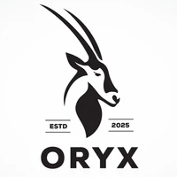

# DRABT Project
### The Oryx Group


## Overview
This project is designed to manage a flashcard system with a RESTful server using Flask. It includes a MySQL database for storing users, cards, flashcards, and decks, as well as Python scripts to provide an API for interacting with the database. This repository includes both a website to allow users to edit their flashcard inventory, as well as a mobile app for viewing purposes.

## Prerequisites

Before setting up the project, ensure that you have the following installed:

- MySQL server (or any compatible database service)
- Python 3.x (Recommended: Python 3.7 or above)
- Python dependencies (Flask, Flask-RESTful, Flask-CORS, MySQL connector)

You can install the Python dependencies with:

```
pip install flask flask-restful flask-cors mysql-connector-python
```

## Database Setup

The project uses a MySQL database for storage. You will need to run the export.sql script to set up the database and tables.

1. Download or Clone the Repository to your web server directory:
```
git clone https://github.com/MQazizada-2024/CS361-Team_Oryx/
cd CS361-Team_Oryx
```
2. Open your MySQL client and log into your database server:
```
mysql -u root -p
```
3. In the MySQL client, run the following command to create the oryx_drabt database and the necessary tables:
```
source ./backend/export.sql
```
4. You can verify the tables were created by running:
```
USE oryx_drabt;
SHOW TABLES;
```
## Setting Up the RESTful Server

In the root directory of your project, run the following command to start the server:
```
python DRABTRestServer.py
```

## Web Server and App
This package includes a website that can be deployed on the same host as the RESTful server, as well as an app that can be distributed to mobile users.